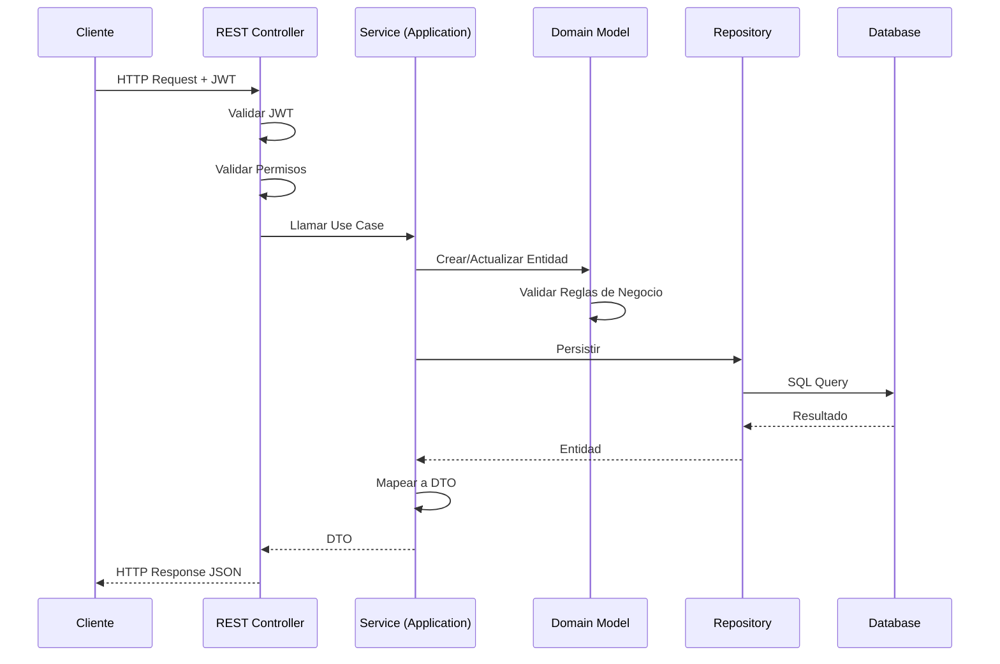

# 📘 Manual Técnico - Sistema de Gestión de Inventario y Ventas

## Índice
1. [Arquitectura del Sistema](#arquitectura-del-sistema)
2. [Requisitos Técnicos](#requisitos-técnicos)
3. [Instalación y Configuración](#instalación-y-configuración)
4. [Base de Datos](#base-de-datos)
5. [Configuración de Seguridad](#configuración-de-seguridad)
6. [Despliegue](#despliegue)
7. [Monitoreo y Mantenimiento](#monitoreo-y-mantenimiento)
8. [Resolución de Problemas](#resolución-de-problemas)
9. [Optimización y Performance](#optimización-y-performance)

---

## 1. Arquitectura del Sistema

### 1.1 Arquitectura Hexagonal (Puertos y Adaptadores)

El sistema implementa Clean Architecture con los siguientes componentes:

```
┌─────────────────────────────────────────────────────────┐
│                    INFRASTRUCTURE                        │
│  ┌──────────────┐  ┌──────────────┐  ┌──────────────┐  │
│  │ Controllers  │  │  Security    │  │  Repository  │  │
│  │   (REST)     │  │    (JWT)     │  │     (JPA)    │  │
│  └──────┬───────┘  └──────┬───────┘  └──────┬───────┘  │
└─────────┼──────────────────┼──────────────────┼─────────┘
          │                  │                  │
┌─────────┼──────────────────┼──────────────────┼─────────┐
│         ▼                  ▼                  ▼          │
│              APPLICATION LAYER                           │
│  ┌──────────────┐  ┌──────────────┐  ┌──────────────┐  │
│  │   Services   │  │     DTOs     │  │   Mappers    │  │
│  │  (Use Cases) │  │              │  │              │  │
│  └──────┬───────┘  └──────────────┘  └──────────────┘  │
└─────────┼──────────────────────────────────────────────┘
          │
┌─────────┼──────────────────────────────────────────────┐
│         ▼                                                │
│                   DOMAIN LAYER                           │
│  ┌──────────────┐  ┌──────────────┐  ┌──────────────┐  │
│  │   Entities   │  │  Repository  │  │  Exceptions  │  │
│  │   (Models)   │  │  Interfaces  │  │   (Domain)   │  │
│  └──────────────┘  └──────────────┘  └──────────────┘  │
└──────────────────────────────────────────────────────────┘
```

### 1.2 Flujo de una Petición



### 1.3 Componentes Principales

#### Domain Layer
- **Modelos de Dominio:** Entidades con lógica de negocio
- **Interfaces de Repositorio:** Contratos para acceso a datos
- **Excepciones de Negocio:** Errores específicos del dominio

#### Application Layer
- **Services:** Implementan casos de uso
- **DTOs:** Objetos de transferencia de datos
- **Mappers:** Conversión entre entidades y DTOs

#### Infrastructure Layer
- **Controllers:** Exponen endpoints REST
- **Repository Implementations:** Implementan acceso a datos con JPA
- **Security:** Configuración JWT y autenticación
- **Configuration:** Beans y configuraciones de Spring

---

## 2. Requisitos Técnicos

### 2.1 Hardware Mínimo

**Desarrollo:**
- CPU: 2 cores
- RAM: 4 GB
- Disco: 10 GB disponibles

**Producción:**
- CPU: 4 cores
- RAM: 8 GB
- Disco: 50 GB disponibles (con espacio para logs y backups)

### 2.2 Software Requerido

#### Sistema Operativo
- Windows 10/11
- Linux (Ubuntu 20.04+, CentOS 8+)
- macOS 11+

#### Java
```bash
# Verificar versión
java -version

# Debe mostrar:
openjdk version "21.0.x" o superior
```

**Instalación Java 21:**

**Windows:**
```bash
# Descargar desde https://adoptium.net/
# O usar SDKMAN
sdk install java 21.0.1-tem
```

**Linux:**
```bash
# Ubuntu/Debian
sudo apt update
sudo apt install openjdk-21-jdk

# CentOS/RHEL
sudo yum install java-21-openjdk-devel
```

#### PostgreSQL

**Versión requerida:** 12 o superior

**Windows:**
```bash
# Descargar instalador desde https://www.postgresql.org/download/windows/
```

**Linux:**
```bash
# Ubuntu/Debian
sudo apt install postgresql postgresql-contrib

# CentOS/RHEL
sudo yum install postgresql-server postgresql-contrib
```

**Iniciar servicio:**
```bash
# Windows
net start postgresql

# Linux
sudo systemctl start postgresql
sudo systemctl enable postgresql
```

#### Gradle

Incluido en el proyecto (`gradlew` / `gradlew.bat`)

**Versión:** 7.6+

---

## 3. Instalación y Configuración

### 3.1 Clonar el Repositorio

```bash
git clone <repository-url>
cd gestion-inventario-ventas
```

### 3.2 Configurar Base de Datos

#### Crear Base de Datos

```sql
-- Conectar a PostgreSQL como superusuario
psql -U postgres

-- Crear base de datos
CREATE DATABASE sistema_inventario_db;

-- Crear usuario (opcional)
CREATE USER inventario_user WITH PASSWORD 'secure_password';

-- Otorgar permisos
GRANT ALL PRIVILEGES ON DATABASE sistema_inventario_db TO inventario_user;

-- Salir
\q
```

#### Verificar Conexión

```bash
psql -U postgres -d sistema_inventario_db -c "SELECT version();"
```

### 3.3 Configurar application.properties

**Desarrollo (`src/main/resources/application.properties`):**

```properties
# Nombre de la aplicación
spring.application.name=gestion-inventario-ventas

# Puerto del servidor
server.port=8080

# Configuración PostgreSQL
spring.datasource.url=jdbc:postgresql://localhost:5432/sistema_inventario_db
spring.datasource.username=postgres
spring.datasource.password=toor
spring.datasource.driver-class-name=org.postgresql.Driver

# JPA / Hibernate
spring.jpa.hibernate.ddl-auto=validate
spring.jpa.show-sql=false
spring.jpa.open-in-view=false
spring.jpa.properties.hibernate.format_sql=true
spring.jpa.properties.hibernate.dialect=org.hibernate.dialect.PostgreSQLDialect

# Flyway
spring.flyway.enabled=true
spring.flyway.locations=classpath:db/migration
spring.flyway.baseline-on-migrate=true
spring.flyway.validate-on-migrate=true

# JWT
security.jwt.secret=MiSuperSecretoMuyLargo1234567890123456!
security.jwt.issuer=gestion-inventario
security.jwt.access-ttl=9h
security.jwt.refresh-ttl=18h

# CORS
app.cors.allowed-origins=http://localhost:4200

# Logging
logging.level.root=INFO
logging.level.com.repuestos.accesorios=DEBUG
logging.file.name=logs/application.log
logging.pattern.console=%d{yyyy-MM-dd HH:mm:ss} - %msg%n

# Actuator
management.endpoints.web.exposure.include=health,info,metrics
management.endpoint.health.show-details=when-authorized
```

**Producción (`src/main/resources/application-prod.properties`):**

```properties
# Base de datos - usar variables de entorno
spring.datasource.url=${DB_URL:jdbc:postgresql://localhost:5432/sistema_inventario_db}
spring.datasource.username=${DB_USERNAME:postgres}
spring.datasource.password=${DB_PASSWORD}

# Seguridad
spring.jpa.show-sql=false
logging.level.root=WARN
logging.level.com.repuestos.accesorios=INFO

# JWT - usar variables de entorno
security.jwt.secret=${JWT_SECRET}

# Pool de conexiones
spring.datasource.hikari.maximum-pool-size=10
spring.datasource.hikari.minimum-idle=5
spring.datasource.hikari.connection-timeout=30000

# SSL (si aplica)
server.ssl.enabled=true
server.ssl.key-store=classpath:keystore.p12
server.ssl.key-store-password=${SSL_PASSWORD}
server.ssl.key-store-type=PKCS12
```

### 3.4 Variables de Entorno

Crear archivo `.env` (no commitear):

```bash
# Base de Datos
DB_URL=jdbc:postgresql://localhost:5432/sistema_inventario_db
DB_USERNAME=postgres
DB_PASSWORD=your_secure_password

# JWT
JWT_SECRET=your_very_long_and_secure_secret_key_here

# Correo (si aplica)
MAIL_HOST=smtp.gmail.com
MAIL_PORT=587
MAIL_USERNAME=your_email@gmail.com
MAIL_PASSWORD=your_app_password

# CORS
ALLOWED_ORIGINS=http://localhost:4200,https://yourdomain.com
```

**Windows:**
```bash
set DB_PASSWORD=your_password
set JWT_SECRET=your_secret
```

**Linux/Mac:**
```bash
export DB_PASSWORD=your_password
export JWT_SECRET=your_secret
```

### 3.5 Compilar el Proyecto

```bash
# Windows
gradlew.bat clean build

# Linux/Mac
./gradlew clean build
```

### 3.6 Ejecutar Migraciones

Las migraciones se ejecutan automáticamente al iniciar la aplicación gracias a Flyway.

**Verificar migraciones manualmente:**

```bash
# Windows
gradlew.bat flywayInfo

# Linux/Mac
./gradlew flywayInfo
```

**Limpiar base de datos (CUIDADO - elimina datos):**

```bash
# Windows
gradlew.bat flywayClean

# Linux/Mac
./gradlew flywayClean
```

### 3.7 Ejecutar la Aplicación

**Modo Desarrollo:**

```bash
# Windows
gradlew.bat bootRun

# Linux/Mac
./gradlew bootRun
```

**Modo Producción:**

```bash
# Compilar JAR
gradlew.bat bootJar

# Ejecutar JAR
java -jar build/libs/gestion-inventario-ventas-0.0.1-SNAPSHOT.jar --spring.profiles.active=prod
```

**Con variables de entorno:**

```bash
java -jar \
  -Dspring.profiles.active=prod \
  -DDB_PASSWORD=secure_pass \
  -DJWT_SECRET=secure_secret \
  build/libs/gestion-inventario-ventas-0.0.1-SNAPSHOT.jar
```

### 3.8 Verificar Instalación

```bash
# Health check
curl http://localhost:8080/actuator/health

# Debe retornar:
{"status":"UP"}
```

---

## 4. Base de Datos

### 4.1 Esquema de Base de Datos

#### Diagrama ER Simplificado

```
┌──────────────┐       ┌──────────────┐       ┌──────────────┐
│   Persona    │       │   Usuario    │       │     Rol      │
├──────────────┤       ├──────────────┤       ├──────────────┤
│ id (PK)      │◄──────┤ id (PK)      │       │ id (PK)      │
│ nombre       │       │ persona_id   │──────►│ nombre       │
│ apellidos    │       │ rol_id       │       │ descripcion  │
│ correo       │       │ contrasenia  │       └──────────────┘
│ telefono     │       │ estado       │
└──────────────┘       └──────────────┘

┌──────────────┐       ┌──────────────┐       ┌──────────────┐
│   Cliente    │       │    Venta     │       │ DetalleVenta │
├──────────────┤       ├──────────────┤       ├──────────────┤
│ id (PK)      │◄──────┤ id (PK)      │──────►│ id (PK)      │
│ persona_id   │       │ cliente_id   │       │ venta_id     │
│ tipo_cliente │       │ usuario_id   │       │ producto_id  │
│ documento    │       │ fecha        │       │ cantidad     │
│ ruc          │       │ total        │       │ precio_unit  │
└──────────────┘       └──────────────┘       └──────────────┘
                                                      │
                        ┌──────────────┐              │
                        │   Producto   │◄─────────────┘
                        ├──────────────┤
                        │ id (PK)      │
                        │ nombre       │
                        │ precio_venta │
                        │ stock        │
                        │ marca_id     │
                        │ categoria_id │
                        └──────────────┘
```

### 4.2 Tablas Principales

#### persona
```sql
CREATE TABLE persona (
    id SERIAL PRIMARY KEY,
    nombre VARCHAR(100) NOT NULL,
    apellido_paterno VARCHAR(100) NOT NULL,
    apellido_materno VARCHAR(100),
    correo VARCHAR(150) UNIQUE NOT NULL,
    telefono VARCHAR(15),
    fecha_creacion TIMESTAMP DEFAULT CURRENT_TIMESTAMP
);
```

#### usuario
```sql
CREATE TABLE usuario (
    id SERIAL PRIMARY KEY,
    persona_id INTEGER REFERENCES persona(id),
    contrasenia VARCHAR(255) NOT NULL,
    rol_id INTEGER REFERENCES rol(id),
    estado VARCHAR(20) NOT NULL,
    fecha_creacion TIMESTAMP DEFAULT CURRENT_TIMESTAMP
);
```

#### producto
```sql
CREATE TABLE producto (
    id SERIAL PRIMARY KEY,
    nombre VARCHAR(100) NOT NULL,
    descripcion VARCHAR(250),
    precio_venta DECIMAL(10, 2) NOT NULL,
    costo_compra DECIMAL(10, 2) NOT NULL,
    stock INTEGER DEFAULT 0,
    stock_minimo INTEGER DEFAULT 0,
    codigo VARCHAR(30) UNIQUE NOT NULL,
    imagen_url VARCHAR(255),
    marca_id INTEGER REFERENCES marca(id),
    categoria_id INTEGER REFERENCES categoria(id),
    activo BOOLEAN DEFAULT TRUE,
    fecha_creacion TIMESTAMP DEFAULT CURRENT_TIMESTAMP
);
```

#### venta
```sql
CREATE TABLE venta (
    id SERIAL PRIMARY KEY,
    cliente_id INTEGER REFERENCES cliente(id),
    usuario_id INTEGER REFERENCES usuario(id),
    fecha TIMESTAMP NOT NULL,
    estado VARCHAR(20) NOT NULL,
    tipo_documento VARCHAR(20) NOT NULL,
    total DECIMAL(10, 2) NOT NULL,
    observaciones VARCHAR(255),
    fecha_creacion TIMESTAMP DEFAULT CURRENT_TIMESTAMP
);
```

### 4.3 Índices Importantes

```sql
-- Índices para mejorar performance
CREATE INDEX idx_producto_codigo ON producto(codigo);
CREATE INDEX idx_producto_nombre ON producto(nombre);
CREATE INDEX idx_persona_correo ON persona(correo);
CREATE INDEX idx_venta_fecha ON venta(fecha);
CREATE INDEX idx_venta_cliente ON venta(cliente_id);
CREATE INDEX idx_detalle_venta_producto ON detalle_venta(producto_id);
```

### 4.4 Backup y Restauración

#### Backup

```bash
# Backup completo
pg_dump -U postgres -d sistema_inventario_db -F c -b -v -f backup_$(date +%Y%m%d).backup

# Backup solo esquema
pg_dump -U postgres -d sistema_inventario_db -s -f schema_$(date +%Y%m%d).sql

# Backup solo datos
pg_dump -U postgres -d sistema_inventario_db -a -f data_$(date +%Y%m%d).sql
```

#### Restauración

```bash
# Restaurar desde backup completo
pg_restore -U postgres -d sistema_inventario_db -v backup_20250113.backup

# Restaurar desde SQL
psql -U postgres -d sistema_inventario_db -f backup.sql
```

#### Script de Backup Automático (Linux)

```bash
#!/bin/bash
# /usr/local/bin/backup_db.sh

DB_NAME="sistema_inventario_db"
BACKUP_DIR="/backups/postgresql"
DATE=$(date +%Y%m%d_%H%M%S)

mkdir -p $BACKUP_DIR

pg_dump -U postgres $DB_NAME | gzip > $BACKUP_DIR/backup_$DATE.sql.gz

# Mantener solo últimos 7 días
find $BACKUP_DIR -name "backup_*.sql.gz" -mtime +7 -delete

echo "Backup completado: backup_$DATE.sql.gz"
```

**Configurar cron:**

```bash
# Editar crontab
crontab -e

# Ejecutar backup diario a las 2 AM
0 2 * * * /usr/local/bin/backup_db.sh
```

---

## 5. Configuración de Seguridad

### 5.1 JWT Configuration

El sistema usa JWT para autenticación stateless.

**Configuración:**

```properties
# application.properties
security.jwt.secret=your_secret_key_minimum_256_bits
security.jwt.issuer=gestion-inventario
security.jwt.access-ttl=9h
security.jwt.refresh-ttl=18h
```

**Generar Secret Seguro:**

```bash
# Linux/Mac
openssl rand -base64 64

# Java
import java.security.SecureRandom;
import java.util.Base64;

SecureRandom random = new SecureRandom();
byte[] bytes = new byte[64];
random.nextBytes(bytes);
String secret = Base64.getEncoder().encodeToString(bytes);
System.out.println(secret);
```

### 5.2 CORS Configuration

```java
@Configuration
public class CorsConfig {
    
    @Value("${app.cors.allowed-origins}")
    private String[] allowedOrigins;
    
    @Bean
    public CorsConfigurationSource corsConfigurationSource() {
        CorsConfiguration configuration = new CorsConfiguration();
        configuration.setAllowedOrigins(Arrays.asList(allowedOrigins));
        configuration.setAllowedMethods(Arrays.asList("GET", "POST", "PUT", "DELETE", "OPTIONS"));
        configuration.setAllowedHeaders(Arrays.asList("*"));
        configuration.setAllowCredentials(true);
        
        UrlBasedCorsConfigurationSource source = new UrlBasedCorsConfigurationSource();
        source.registerCorsConfiguration("/api/**", configuration);
        return source;
    }
}
```

### 5.3 Seguridad de Contraseñas

El sistema usa BCrypt para hashear contraseñas:

```java
@Bean
public PasswordEncoder passwordEncoder() {
    return new BCryptPasswordEncoder(12); // Fuerza 12
}
```

**Requisitos de contraseña:**
- Mínimo 8 caracteres
- Al menos una mayúscula
- Al menos una minúscula
- Al menos un número
- Al menos un carácter especial

### 5.4 Rate Limiting (Recomendado)

Implementar con Bucket4j o Redis:

```xml
<!-- pom.xml o build.gradle -->
<dependency>
    <groupId>com.github.vladimir-bukhtoyarov</groupId>
    <artifactId>bucket4j-core</artifactId>
    <version>7.6.0</version>
</dependency>
```

---

## 6. Despliegue

### 6.1 Despliegue Local (Desarrollo)

```bash
# Compilar y ejecutar
gradlew.bat bootRun
```

### 6.2 Despliegue con JAR

```bash
# Compilar JAR ejecutable
gradlew.bat bootJar

# JAR generado en:
# build/libs/gestion-inventario-ventas-0.0.1-SNAPSHOT.jar

# Ejecutar
java -jar build/libs/gestion-inventario-ventas-0.0.1-SNAPSHOT.jar
```

### 6.3 Despliegue como Servicio (Linux)

**Crear servicio systemd:**

```bash
sudo nano /etc/systemd/system/inventario.service
```

```ini
[Unit]
Description=Sistema Gestión Inventario
After=postgresql.service

[Service]
Type=simple
User=inventario
WorkingDirectory=/opt/inventario
ExecStart=/usr/bin/java -jar \
  -Dspring.profiles.active=prod \
  -Xms512m -Xmx2048m \
  /opt/inventario/gestion-inventario-ventas.jar

Restart=on-failure
RestartSec=10

[Install]
WantedBy=multi-user.target
```

**Activar servicio:**

```bash
sudo systemctl daemon-reload
sudo systemctl enable inventario
sudo systemctl start inventario
sudo systemctl status inventario
```

### 6.4 Despliegue con Docker (Sin Docker Compose)

**Dockerfile:**

```dockerfile
FROM eclipse-temurin:21-jdk-alpine AS build
WORKDIR /app
COPY . .
RUN ./gradlew bootJar --no-daemon

FROM eclipse-temurin:21-jre-alpine
WORKDIR /app
COPY --from=build /app/build/libs/*.jar app.jar

EXPOSE 8080

ENTRYPOINT ["java", "-jar", "/app/app.jar"]
```

**Construir imagen:**

```bash
docker build -t inventario-app:latest .
```

**Ejecutar contenedor:**

```bash
docker run -d \
  --name inventario-app \
  -p 8080:8080 \
  -e DB_URL=jdbc:postgresql://host.docker.internal:5432/sistema_inventario_db \
  -e DB_USERNAME=postgres \
  -e DB_PASSWORD=toor \
  -e JWT_SECRET=your_secret \
  inventario-app:latest
```

### 6.5 Despliegue en la Nube

#### Heroku

```bash
# Instalar Heroku CLI
heroku login

# Crear aplicación
heroku create inventario-app

# Agregar PostgreSQL
heroku addons:create heroku-postgresql:hobby-dev

# Configurar variables
heroku config:set JWT_SECRET=your_secret

# Deploy
git push heroku main
```

#### AWS Elastic Beanstalk

```bash
# Crear archivo .ebextensions/options.config
option_settings:
  aws:elasticbeanstalk:application:environment:
    SERVER_PORT: 5000
    SPRING_PROFILES_ACTIVE: prod
```

---

## 7. Monitoreo y Mantenimiento

### 7.1 Logs

**Configuración:**

```properties
# application.properties
logging.level.root=INFO
logging.level.com.repuestos.accesorios=DEBUG
logging.file.name=logs/application.log
logging.pattern.file=%d{yyyy-MM-dd HH:mm:ss} [%thread] %-5level %logger{36} - %msg%n
logging.file.max-size=10MB
logging.file.max-history=30
```

**Ver logs en tiempo real:**

```bash
# Linux
tail -f logs/application.log

# Windows PowerShell
Get-Content logs\application.log -Wait
```

### 7.2 Actuator Endpoints

```properties
management.endpoints.web.exposure.include=health,info,metrics,prometheus
management.endpoint.health.show-details=when-authorized
```

**Endpoints disponibles:**

- `/actuator/health` - Estado de salud
- `/actuator/info` - Información de la app
- `/actuator/metrics` - Métricas de performance

### 7.3 Métricas con Prometheus

```xml
<dependency>
    <groupId>io.micrometer</groupId>
    <artifactId>micrometer-registry-prometheus</artifactId>
</dependency>
```

**Endpoint:** `/actuator/prometheus`

---

## 8. Resolución de Problemas

### 8.1 La aplicación no inicia

**Error:** `Address already in use: bind`

**Solución:**
```bash
# Ver qué proceso usa el puerto 8080
# Windows
netstat -ano | findstr :8080
taskkill /PID <PID> /F

# Linux
sudo lsof -i :8080
sudo kill -9 <PID>
```

**Cambiar puerto:**
```properties
server.port=8081
```

### 8.2 Error de conexión a PostgreSQL

**Error:** `org.postgresql.util.PSQLException: Connection refused`

**Verificar:**
```bash
# PostgreSQL corriendo?
# Windows
sc query postgresql

# Linux
sudo systemctl status postgresql
```

**Verificar configuración:**
```bash
psql -U postgres -c "SHOW port;"
psql -U postgres -c "SHOW listen_addresses;"
```

### 8.3 Flyway migration failed

**Error:** `FlywayException: Validate failed`

**Solución:**
```sql
-- Verificar estado
SELECT * FROM flyway_schema_history;

-- Reparar (si es necesario)
-- Conectar a psql y ejecutar:
DELETE FROM flyway_schema_history WHERE success = false;
```

### 8.4 JWT Token expired

**Error:** `401 Unauthorized`

**Solución:** Usar el endpoint `/api/auth/refresh`

### 8.5 Out of Memory

**Error:** `java.lang.OutOfMemoryError: Java heap space`

**Solución:**
```bash
java -Xms512m -Xmx2048m -jar app.jar
```

---

## 9. Optimización y Performance

### 9.1 JVM Tuning

```bash
java -jar \
  -Xms512m \
  -Xmx2048m \
  -XX:+UseG1GC \
  -XX:MaxGCPauseMillis=200 \
  -XX:+HeapDumpOnOutOfMemoryError \
  -XX:HeapDumpPath=/logs/heapdump.hprof \
  app.jar
```

### 9.2 Database Connection Pool

```properties
spring.datasource.hikari.maximum-pool-size=10
spring.datasource.hikari.minimum-idle=5
spring.datasource.hikari.connection-timeout=30000
spring.datasource.hikari.idle-timeout=600000
spring.datasource.hikari.max-lifetime=1800000
```

### 9.3 Cachéing con Redis (Opcional)

```xml
<dependency>
    <groupId>org.springframework.boot</groupId>
    <artifactId>spring-boot-starter-data-redis</artifactId>
</dependency>
```

```properties
spring.redis.host=localhost
spring.redis.port=6379
spring.cache.type=redis
```

---

## 10. Checklist de Producción

- [ ] Cambiar `JWT_SECRET` a un valor seguro
- [ ] Configurar variables de entorno
- [ ] Usar `spring.profiles.active=prod`
- [ ] Deshabilitar `spring.jpa.show-sql`
- [ ] Configurar HTTPS/SSL
- [ ] Implementar rate limiting
- [ ] Configurar backups automáticos de BD
- [ ] Configurar logging adecuado
- [ ] Implementar monitoreo (Prometheus/Grafana)
- [ ] Configurar alertas
- [ ] Documentar procedimientos de emergencia
- [ ] Realizar pruebas de carga

---

**Versión:** 1.0.0  
**Última actualización:** 13 de Noviembre, 2025  
**Autor:** Sistema de Gestión de Inventario - Proyecto de Tesis

